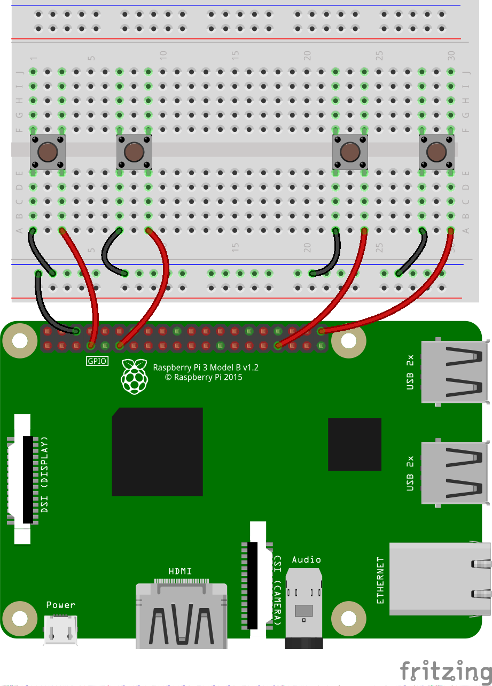

## A home-brew game controller

### Requirements
For this stage, you will need a second Raspberry Pi and the following hardware as well as your buggy.
- 1 x solderless breadboard
- 4 x tactile buttons
- 5 x male-to-female jumper leads
- 4 x male-to-male jumper leads 

### Instructions

- The first stage is to wire up four buttons to your spare Raspberry Pi. Have a look at the section below if you haven't used buttons with a Raspberry Pi before.

[[[rpi-gpio-wiring-a-button]]]

- Here's one way that you could wire up your buttons, including a common ground rail to avoid using too many wires.

	

- On the Raspberry Pi that is attached to the buggy, you will need to start the **pigpio daemon** if you haven't already done so. To do this, open up a terminal window and type the following:

	```bash
	sudo systemctl enable pigpiod
	```
- Then you can find the Raspberry Pi's IP address using this line of code:

	```bash
	hostname -I
	```
	
- Now you can begin to program the Raspberry Pi that is connected to the breadboard controller. Open up Python 3 IDLE.

- If you haven't used remotely controlled GPIO pins, or programmed using buttons before, you might like to have a look at the sections below.

[[[rpi-python-function-calls-with-buttons]]]
[[[rpi-python-remote-pins]]]

- Begin by importing the modules you need, and setting up the remote pins for the robot:

	```python
	from gpiozero import Robot, Button
	from gpiozero.pins.pigpio import PiGPIOFactory

	factory = PiGPIOFactory(host="192.168.1.79") ##add in your Pi's IP here
	robot = Robot(left=(factory.pin(7), factory.pin(8)), right=(factory.pin(9), factory.pin(10)))
	forward = Button(4)
	backward = Button(17)
	right = Button(13)
	left = Button(21)
	```
- For the rest of your project you need to add code to your script to drive the robot in the right direction when a specific button is pushed, and stop the robot when the button is released. Have a look at the hints below if you need a little help.

--- hints --- --- hint ---
Use the `when_pressed` and `when_released` methods of the `Button` class to drive the robot and stop it.
--- /hint --- --- hint ---
Here's some example code that will drive the robot forwards and stop it.
```python
forward.when_pressed = robot.forward
forward.when_released = robot.stop
```
--- /hint --- --- hint ---
Here's a video to help you understand how to program the controller.
<video width="560" height="315" controls>
<source src="images/home-brew-remote.webm" type="video/webm">
If your browser does not support WebM video, try Firefox or Chrome.
</video>

--- /hint --- --- /hints ---
